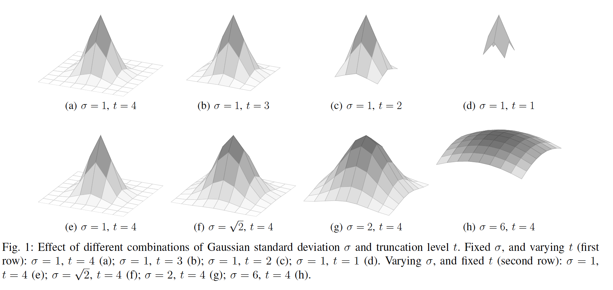
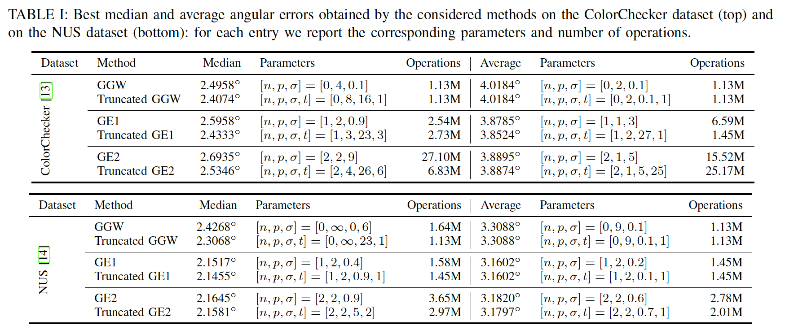

# Truncated Edge-based Color Constancy
Official implementation of the paper [Truncated Edge-based Color Constancy](https://drive.google.com/file/d/1fL_bD9b4-ac4kkt9G04I2fjdA_MjGXTY/view?usp=sharing)

[Simone Bianco](http://www.ivl.disco.unimib.it/people/simone-bianco/)1, [Marco Buzzelli](http://www.ivl.disco.unimib.it/people/marco-buzzelli/)1

1University of Milano-Bicocca, Italy

### Abstract
In this paper we propose the truncated edge-based
color constancy. It is based on, and extends, the [Edge-Based Color Constancy](https://ieeexplore.ieee.org/document/4287009) [[code](http://cat.cvc.uab.es/~joost/code/ColorConstancy.zip)]
framework by introducing the use of truncated Gaussian filters.
The truncation level can be controlled with the use of a dedicated
parameter that is added to the other three parameters existing
in the edge-based framework, namely the derivative order, the
standard deviation of the Gaussian filter, and the Minkowski
norm. Experimental results on two standard dataset for color
constancy show that the truncated edge-based framework allows
to achieve the same or higher illuminant estimation accuracy of
the edge-based framework considerably reducing the number of
operations.

### Effect of different combinations of the standard deviation of the Gaussian filter and the truncation level

### Results 

### Running the code
You can run the file `general_cc_truncated.m` in Matlab to perform illuminant estimation with the truncated edge-based color constancy.
For a demo, you can run the file `ColorConstancyDemo.m`.
